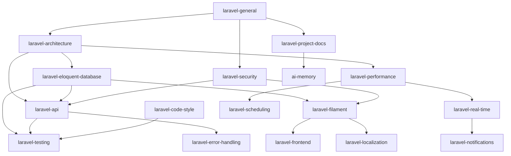

# Laravel Best Practice Skills for GitHub Copilot

> **Version 2.0.0** — 18 skills covering the full Laravel ecosystem

A comprehensive set of GitHub Copilot agent skills that enforce Laravel best practices, coding standards, and architectural patterns across all your Laravel projects. Compatible with **Laravel 10+** with recommendations to upgrade to the latest version where applicable.

## What is this?

This is a collection of modular **GitHub Copilot Skills** — instructional documents that teach AI coding assistants (Claude, GPT-4o, Gemini, etc.) how to write Laravel code according to established best practices and your preferred conventions.

Once installed, these skills are automatically activated when you work on Laravel projects, so you never have to repeat coding instructions from scratch.

## Skills Included

### Core Skills

| Skill | Description |
|-------|-------------|
| **laravel-general** | Core principles, conventions, project structure, philosophy, middleware |
| **laravel-architecture** | Services, Actions, DTOs, Repository, Pipeline, Value Objects, DDD |
| **laravel-eloquent-database** | Eloquent, migrations, UUID/ULID, polymorphic, Scout, pruning |
| **laravel-api** | REST API, Resources, Sanctum, Scramble docs, CORS, webhooks, bulk ops |
| **laravel-security** | Validation, Policies, 2FA, CSP, signed URLs, dependency auditing |
| **laravel-performance** | Caching, queues, Octane, HTTP caching, image optimization, pooling |
| **laravel-testing** | Pest/PHPUnit, Dusk, arch testing, mutation testing, factories |
| **laravel-code-style** | PSR-12, Pint, Larastan, Rector PHP, Git hooks, naming conventions |

### Specialized Skills

| Skill | Description |
|-------|-------------|
| **laravel-filament** | Filament 3 admin panels, resources, forms, tables, widgets, multi-tenancy |
| **laravel-real-time** | Broadcasting with Reverb, Echo, channels, presence, WebSockets |
| **laravel-notifications** | Mail, database, broadcast, SMS, Slack notifications, queuing |
| **laravel-scheduling** | Task scheduling, Artisan commands, cron, overlapping prevention |
| **laravel-error-handling** | Exception handling, custom exceptions, logging, Sentry integration |
| **laravel-localization** | Translations, locale middleware, date/number formatting, i18n |
| **laravel-frontend** | Blade, Livewire, Inertia.js, SSR, PWA, Vite configuration |
| **laravel-deployment** | Docker, CI/CD, environment configuration, monitoring |

### Meta Skills

| Skill | Description |
|-------|-------------|
| **laravel-project-docs** | Project analysis, planning, technical documentation generation |
| **ai-memory** | Persistent AI memory — project context, work tracking, session continuity |

## Skill Dependency Map



## Installation

### Option 1: One-command install (recommended)

Run a single command to install all skills automatically:

**Windows (PowerShell):**

```powershell
irm https://raw.githubusercontent.com/sasabajic/laravel-best-practice-skills/main/install.ps1 | iex
```

**macOS / Linux:**

```bash
curl -fsSL https://raw.githubusercontent.com/sasabajic/laravel-best-practice-skills/main/install.sh | bash
```

This clones the repo, copies all skill folders into `~/.copilot/skills/`, and cleans up automatically. Run the same command again to update to the latest version.

### Option 2: Install individual skills via npx

If you only need specific skills, install them individually:

```bash
npx skills add sasabajic/laravel-best-practice-skills@laravel-general -g -y
npx skills add sasabajic/laravel-best-practice-skills@laravel-architecture -g -y
```

Available skill names: `laravel-general`, `laravel-architecture`, `laravel-eloquent-database`, `laravel-api`, `laravel-testing`, `laravel-security`, `laravel-performance`, `laravel-frontend`, `laravel-code-style`, `laravel-deployment`, `laravel-project-docs`, `ai-memory`

### Option 3: Manual installation (clone & copy)

**1.** Clone the repo to any local directory:

```bash
git clone https://github.com/sasabajic/laravel-best-practice-skills.git
```

**2.** Copy the **contents** of the cloned folder directly into the Copilot skills directory:

```bash
# Windows (PowerShell)
Copy-Item -Path ".\laravel-best-practice-skills\*" -Destination "$env:USERPROFILE\.copilot\skills\" -Recurse -Force

# macOS / Linux
cp -r laravel-best-practice-skills/* ~/.copilot/skills/
```

The result should look like this:

```
~/.copilot/skills/
├── laravel-general/SKILL.md
├── laravel-architecture/SKILL.md
├── laravel-api/SKILL.md
├── ai-memory/SKILL.md
├── ... (other skill folders)
├── README.md
└── LICENSE
```

> **Important:** Skill folders must be directly inside `skills/`, NOT nested in a subfolder. Copilot expects the structure `skills/[skill-name]/SKILL.md`.

## How It Works

1. **GitHub Copilot** reads the `SKILL.md` file description from each installed skill
2. When you work on a task that matches a skill's domain, Copilot automatically loads the relevant instructions
3. The AI follows those instructions when generating code, reviewing, or explaining
4. Works with **any AI model** in Copilot (Claude, GPT-4o, Gemini) — instructions are model-agnostic

## Customization

These skills represent opinionated best practices. Feel free to:

- Fork this repo and customize rules to match your team's conventions
- Remove skills you don't need
- Add your own project-specific skills alongside these
- Adjust code examples to match your preferred stack (e.g., Livewire vs Inertia)

## Model Compatibility

Skills are written as clear, structured Markdown instructions. They work equally well with:

- **Claude** (Anthropic) — optimized for instruction following
- **GPT-4o** (OpenAI) — follows structured rules well
- **Gemini** (Google) — handles markdown instructions effectively

The key is that instructions are explicit, specific, and example-driven — which all models handle well.

## Author

**Sasa Bajic** — BS Computer / BSC IT Solutions

- [https://bscomputer.com](https://bscomputer.com)
- [https://bscsolutions.rs](https://bscsolutions.rs)
- [https://sasabajic.com](https://sasabajic.com)
- GitHub: [https://github.com/sasabajic/laravel-best-practice-skills](https://github.com/sasabajic/laravel-best-practice-skills)

## Contributing

PRs welcome! If you have Laravel best practices to add or improve, please contribute.

## License

Laravel Best Practice Skills for GitHub Copilot
Copyright (C) 2026 Sasa Bajic - BS Computer / BSC IT Solutions

This program is free software; you can redistribute it and/or modify
it under the terms of the GNU General Public License as published by
the Free Software Foundation; either version 2 of the License, or
(at your option) any later version.

This program is distributed in the hope that it will be useful,
but WITHOUT ANY WARRANTY; without even the implied warranty of
MERCHANTABILITY or FITNESS FOR A PARTICULAR PURPOSE. See the
GNU General Public License for more details.

You should have received a copy of the GNU General Public License
along with this program; if not, see [https://www.gnu.org/licenses/](https://www.gnu.org/licenses/).

See the [LICENSE](LICENSE) file for the full license text.
